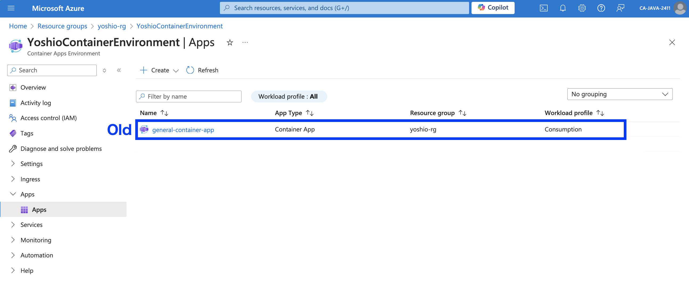
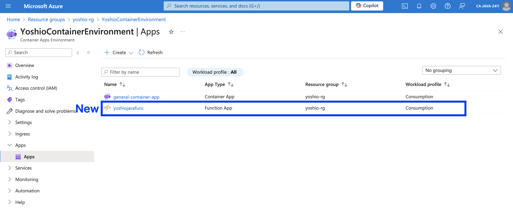
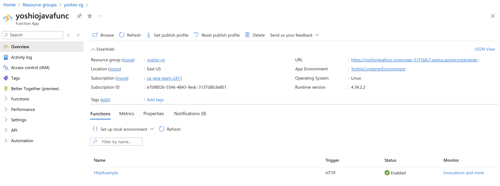
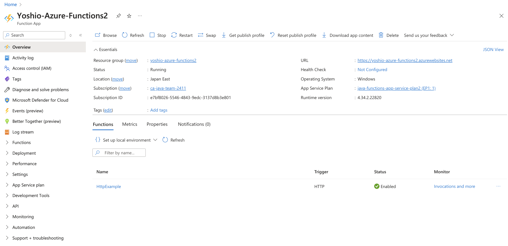
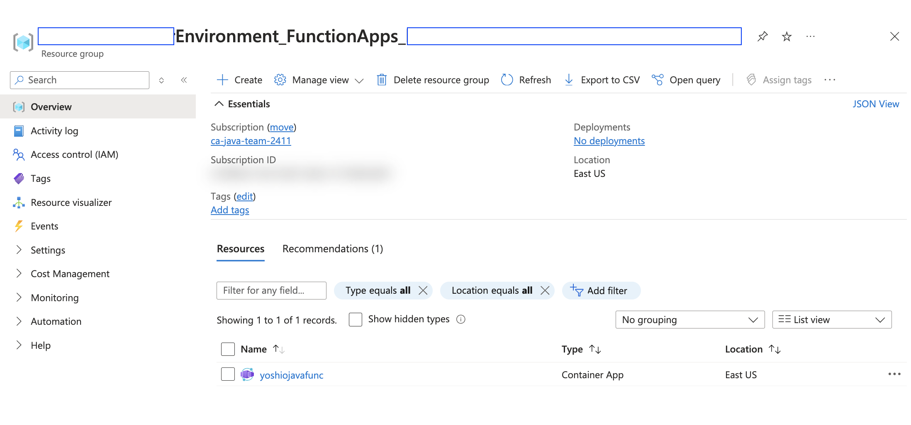

# Comparison of Two Methods for Deploying Azure Functions to Azure Container Apps

Yesterday, I wrote an article titled "[Deploying a Java Azure Function on Azure Container Apps](https://dev.to/azure/deploying-a-java-azure-function-on-azure-container-apps-1oj)."

In that entry, I mentioned using the `Azure's integrated management capabilities` and I want to clarify what that means and how it differs from previous methods in this article.

## Old Method: Creating with `az containerapp create`

Azure Container Apps is one of Azure's container execution environments, allowing you to run any containerized service. Previously, if you wanted to run Azure Functions in Azure Container Apps, you would create an instance using the following command:

```bash
az containerapp create \
--name general-container-app \
--resource-group $RESOURCE_GROUP_NAME \
--environment $CONTAINER_ENVIRONMENT \
--registry-server $CONTAINER_REGISTRY_SERVER \
--image $CONTAINER_REGISTRY_SERVER/$C_IMAGE_NAME:$C_IMAGE_TAG \
--target-port 80 \
--ingress external \
--query properties.configuration.ingress.fqdn
```

After executing the command, you would see a message like this:

```text
Container app created. Access your app at https://general-container-app.niceocean-********.eastus.azurecontainerapps.io/
```

You could then use a `curl` command to connect to your Azure Functions service:

```bash
curl https://general-container-app.niceocean-********.eastus.azurecontainerapps.io/api/httpexample?name=World
```

Upon accessing the Azure Container Apps Environment, you would see that the `general-container-app` is created as a `Container App`, and this management interface is available for any deployed containerized application.



## New Method: Creating with `az functionapp create`

The new method allows you to create Azure Functions in Azure Container Apps using the `az functionapp create` command instead of `az containerapp create`.

```bash
az functionapp create \
--name $AZURE_FUNCTION_NAME \
--resource-group $RESOURCE_GROUP_NAME \
--environment $CONTAINER_ENVIRONMENT \
--storage-account $STORAGE_NAME \
--workload-profile-name "Consumption" \
--max-replicas 15 \
--min-replicas 1 \
--functions-version 4 \
--runtime java \
--image $CONTAINER_REGISTRY_SERVER/$C_IMAGE_NAME:$C_IMAGE_TAG \
--assign-identity
```

With this command, your Azure Functions will be created in Azure Container Apps, and the management interface will clearly show that it is an `Function App`.



This means Azure Functions can now be managed through a dedicated `Azure Functions management interface`, making it distinct from other container services.

However, there are some differences between the management features provided in Azure App Service and those available for Azure Functions on Container Apps. For instance, certain functionalities like diagnostic tools, deployment features, and others may not be available.



### Reference: Azure Functions on App Service (Portal)

For comparison, here’s the management interface for Azure Functions deployed on Azure App Service.



The differences in management capabilities between App Service and Azure Container Apps can include:


```text
- Diagnose and solve problems
- Microsoft Defender for Cloud
- Events (preview)
- Log stream
- Deployment
- App Service plan
- Development Tools
- Monitoring
- Support + troubleshooting
```

Some may think that the lack of certain features suggests missing functionality.

However, when deployed to Azure Container Apps, the operating environment is container-based, which changes deployment and management methods. Features not included in the Azure Functions management interface will need to be managed separately through the Azure Container Apps interface.

## Management of Containers in Azure Container Apps

When using the `az functionapp create` command to create an Azure Functions instance on Azure Container Apps, a new resource group is automatically created that houses the container instance.



In my environment, the resource group name follows this convention: 

`$CONTAINER_ENVIRONMENT_FunctionApps_$UUID`

You will see that an Azure Container Apps instance named after your specified `$AZURE_FUNCTION_NAME` has been generated.

When you click on this instance, you'll be directed to a management interface specific to Azure Container Apps, where the Azure Functions run as container instances.


Azure Container Apps provides different CI/CD and deployment methods than Azure App Service. It also allows for features offered at the container level, such as Dapr and Service Connector, which can be utilized.

## Conclusion

Previously, it was possible to run Azure Functions by containerizing them in a container execution environment, but there was no dedicated management interface for Azure Functions.

With this new method, Azure Functions and Azure Container Apps have integrated, offering a container environment with an associated Azure Functions management interface.

I know some customers operate Azure Functions Container on Azure Kubernetes Service (AKS). Previously, they lacked a dedicated management interface. However, by deploying to Azure Container Apps, they can now use Azure Functions management while enjoying the simplicity of managing Azure Container Apps compared to managing operations on AKS.

The methods for deploying Azure Functions to Azure Container Apps are likely to evolve further. I look forward to seeing how this develops.
