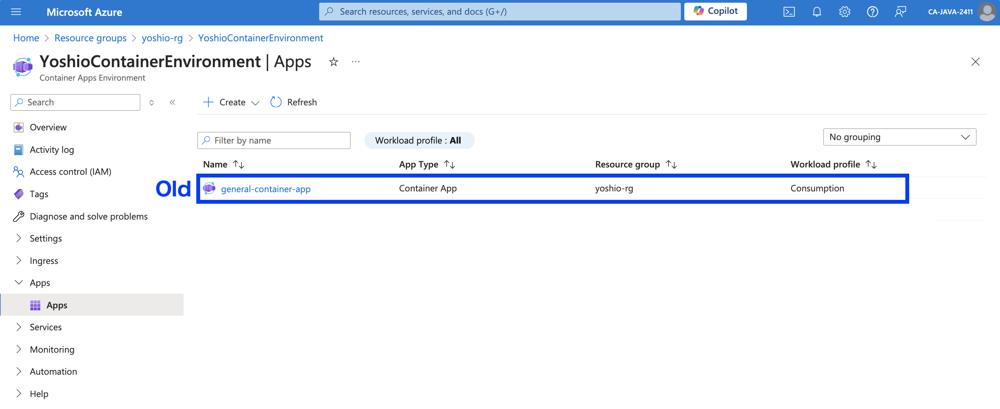
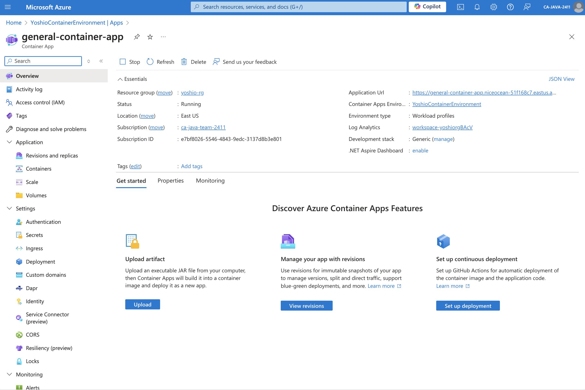
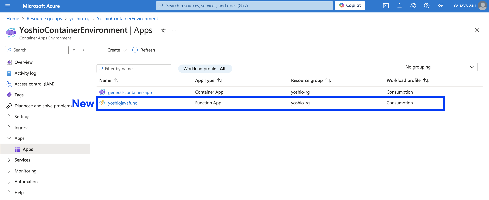
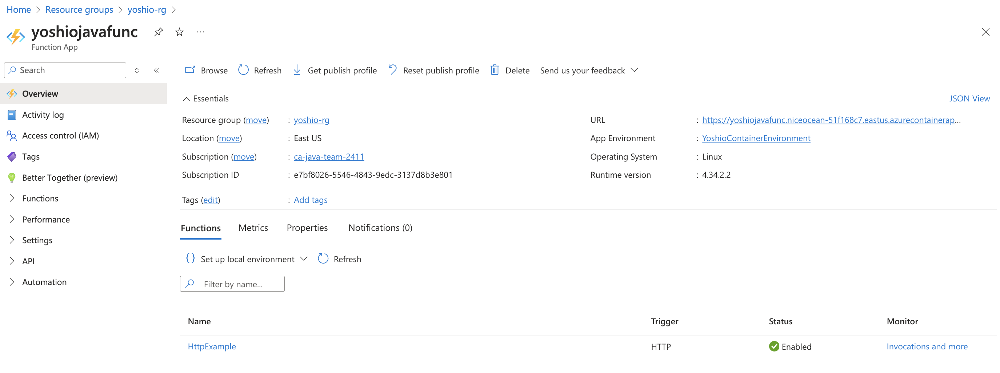
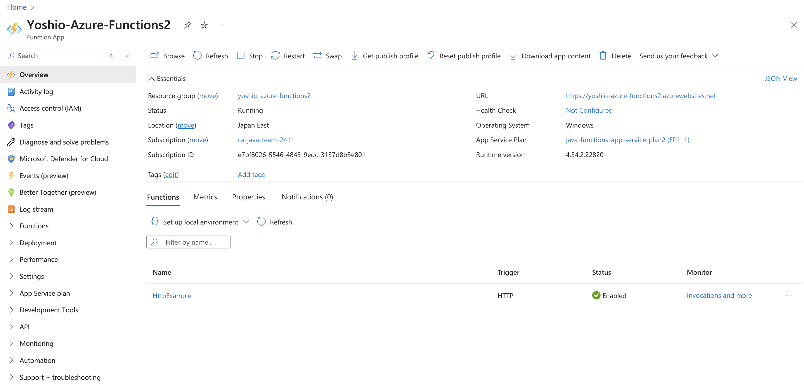
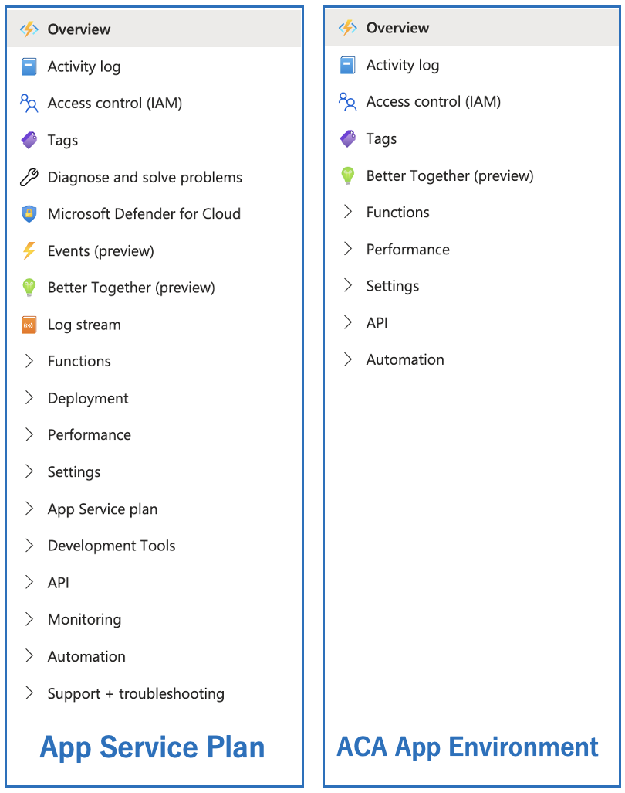
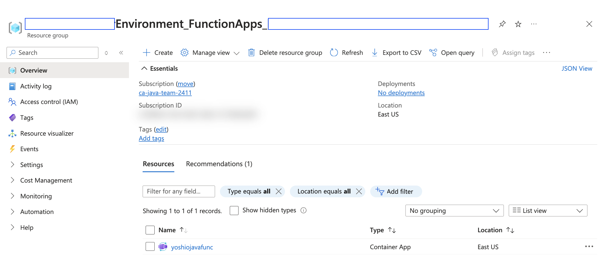
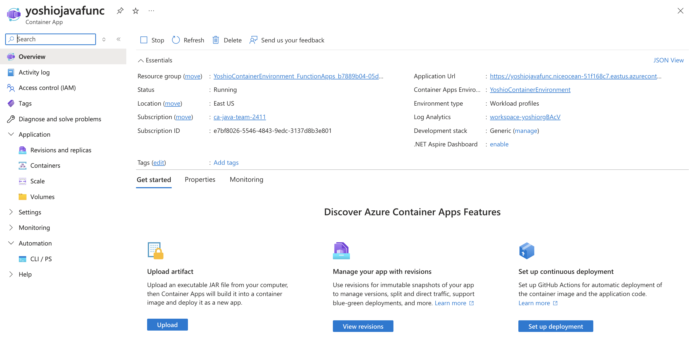

# Azure Functions を Azure Container Apps にデプロイする 2 種類の方法の比較について

昨日、「[Azure Container Apps に対して Java Azure Function on Linnux Container をデプロイ](https://qiita.com/yoshioterada/items/0ef6c1a0ffd65bf3cace)」というエントリを記載しました。

エントリ中に「統合された Azure の管理ポータルを使用」と記載しましたが、これが何を意味するのか、そして今までと何が違うのかを明確にするために、本エントリで今までとの違いとメリットについて記載したいと思います。

* 旧来の方法： `az containerapp create` で作成
* 新しい方法： `az functionapp create` で作成

## 旧来の方法： `az containerapp create` で作成

Azure Container Apps は Azure のコンテナ実行環境の一つとして提供されています。そこでコンテナ化されたサービスであれば任意のサービスを動作させる事ができます。

その意味で、今までも Azure Functions のサービスをコンテナ化すれば、Azure Container Apps 環境で、Azure Functions のサービスを動作させる事ができました。そのためには、今まで下記のようなコマンドを実行して Azure Container Apps のインスタンスを生成していました。

```azurecli
az containerapp create \
  --name general-container-app \
  --resource-group $RESOURCE_GROUP_NAME \
  --environment $CONTAINER_ENVIRONMENT \
  --registry-server  $CONTAINER_REGISTRY_SERVER \
  --image $CONTAINER_REGISTRY_SERVER/$C_IMAGE_NAME:$C_IMAGE_TAG \
  --target-port 80 \
  --ingress external \
  --query properties.configuration.ingress.fqdn
```

コマンドを実行すると下記のような内容が表示されます。

```text
Container app created. Access your app at https://general-container-app.niceocean-********.eastus.azurecontainerapps.io/

"general-container-app.niceocean-********.eastus.azurecontainerapps.io"
```

そこで、`curl` コマンドを実行して Azure Functions のサービスに接続ができます。

```bash
curl https://general-container-app.niceocean-********.eastus.azurecontainerapps.io/api/httpexample?name=World
```

この時、Azure Container Apps の Environment にアクセスすると、下記のような画面が表示されます。



そして、アプリケーションの中から `general-container-app` を選ぶと下記のような画面が表示されます。



こちらの画面を確認していただくと、`general-container-app` は `Container App` として作成されている事がわかります。この `Container App` は、任意のコンテナをデプロイすると、このような管理画面が提供されています。つまり、Azure Functions のコンテナに限らず、Spring Boot や Quarkus などのアプリケーションをコンテナ化してデプロイした際に表示される管理画面になります。

## 新しい方法： `az functionapp create` で作成

次に、新しい方法で Azure Functions を Azure Container Apps に作成する方法を紹介します。新しい方法では `az containerapp create` コマンドの代わりに、`az functionapp create` コマンドを利用して Azure Container Apps にインスタンスを作成できます。 

```azurecli
az functionapp create --name $AZURE_FUNCTION_NAME \
--resource-group $RESOURCE_GROUP_NAME \
--environment $CONTAINER_ENVIRONMENT \
--storage-account $STORAGE_NAME \
--workload-profile-name "Consumption" \
--max-replicas 15 --min-replicas 1 \
--functions-version 4 \
--runtime java \
--image $CONTAINER_REGISTRY_SERVER/$C_IMAGE_NAME:$C_IMAGE_TAG \
--assign-identity
```

この方法で Azure Container Apps に Azure Functions のアプリを作成した場合、Azure の管理画面では下記のように表示されます。



`App Type` が `Function App` として作成されている事がお分かりいただけます。
そして、このリンクをクリックすると下記のような画面が表示されます。下記の Azure Functions は、Azure Container Apps にデプロイされた Azure Functions のインスタンスです。それにも関わらず、Azure Functions の管理画面が提供されています。
つまり、この方法を利用して Azure Functions を Azure Container Apps にデプロイすると、単なるコンテナのサービスの一つとして扱うのではなく、Azure Functions として管理できるようになります。

ただし、App Service にデプロイした Azure Functions で提供する管理機能と一部異なる部分があります。



### 参考： Azure Functions on App Service (Portal)

参考のために Azure App Service にデプロイした Azure Functions の管理画面を示します。



実際に、App Service Plan と Azure Container Apps で提供する Azure Functions の管理画面の違いを示します。



ACA にデプロイした Azure Functions に含まれていない管理機能

```text
- Diagnose and solve problems
- Microsoft Defender for Cloud
- Events (preview)
- Log stream
- Deployment
- App Service plan
- development Tools
- Monitoring
- Support + troubleshooting
```

上記の比較を行っただけでは一部の機能が含まれていないため機能が不足していると思われるかもしれません。しかし Azure Container Apps にデプロイした場合実際の動作環境はコンテナの環境で動作します。つまり、デプロイ方法や管理方法が App Service とは異なります。
そこで、上記に示す管理画面に含まれていない機能は別途、Azure Container Apps のインスタンスの管理画面で行います。

## Azure Container Apps のコンテナの管理

`az functionapp create` のコマンドを利用して ACA 上に作成した Azure Functions の Container のインスタンスは、作成時に自動的に新しいリソースグループを作成し、その中に Container のインスタンスの実態が作成されます。



私の環境では、下記の命名規則に従ってリソース・グループの名前が自動的に生成されていました。

`$CONTAINER_ENVIRONMENT_FunctionApps_$UUID`

そして、ご覧いただくように $AZURE_FUNCTION_NAME で指定した名前の Azure Container Apps のインスタンスが生成されています。

実際にインスタンスをクリックすると下記のような Azure Container Apps のインスタンスの管理画面が表示されます。これが Azure Functions が実際に動作するコンテナのインスタンスです。



Azure Container Apps は Azure App Service とは異なる CI/CD やデプロイ方法を提供しています。また、Azure Container 側で提供している機能、例えば Dapr や Service Connector などの機能も利用する事ができるようになります。

## まとめ

今までも、Azure Functions をコンテナ化してコンテナの実行環境で動作させる事はできました。しかし、Azure Function として管理画面が用意される事はなく、他の通常のコンテナと同じように扱う必要がありました。

今回の新しい方法では Azure Functions と Azure Container Apps が統合された事により、実際に動作する環境はコンテナの環境ですが、Azure Functions の管理画面も提供され、さらに Azure Container Apps の管理画面で、コンテナのインスタンスを管理する事ができるようになりました。

私の知るお客様の中にも、Azure Functions を Azure Kubernetes Service 上で稼働させ運用している事例があります。このような場合、今までは Azure Functions の管理画面は一歳提供されていませんでした。しかし、Azure Container Apps にデプロイする事で、Azure Functions の管理画面も利用でき、Azure Container Apps の管理の容易さから、AKS 上で運用管理をするのに比べてとても容易になると思います。

Azure Functions を Azure Container Apps にデプロイする方法は、今後も進化していくと思います。今後の進化にも注目していきたいと思います。
